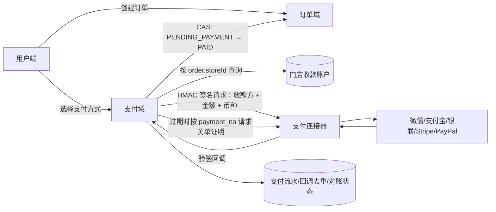

# 支付交易与订单模块设计

## 目标与边界

订单负责商品、价格、履约和业务状态；支付负责收款账户、支付意图、资金交易、回调事件与对账状态。两者通过 `orderId` 关联，但订单不能根据客户端“支付成功”页面自行变为已支付。

当前核心支持微信支付、支付宝、银联、Stripe、PayPal 五类提供方。厂商 SDK、商户私钥、API Key 和平台证书运行在支付连接器中，LingDian 只调用统一的签名协议。这样可以独立完成证书轮换和厂商 API 升级，也可以让不同门店使用不同收款主体。



## 关键安全约束

1. 金额由服务端按 SKU 和选项重算，以最小货币单位存入支付域；不接受客户端金额。
2. 收款方由 `order.storeId + provider + channel` 唯一解析，客户端没有 `accountId` 或商户号输入位。
3. 连接器创建结果必须回显相同的收款账号、金额和币种；任一不一致即失败并标记人工核对。
4. 回调使用 `timestamp + nonce + rawBody` 做 HMAC-SHA256 验签，允许时钟偏差 5 分钟，并使用恒定时间比较。
5. 回调事件用 `provider + accountId + eventId` 去重；相同事件号若载荷哈希不同会被拒绝。
6. 支付成功时再次核对支付号、提供方交易号、收款账号、金额、币种和外部支付意图号。
7. 订单状态使用条件更新；在线支付订单只能由已验签回调从 `PENDING_PAYMENT` 变为 `PAID`。
8. 已取消或超时订单收到迟到付款时，资金流水仍记录为成功，但订单不恢复，支付意图标记 `LATE_PAYMENT` 等待退款/人工处理。
9. 数据库不保存商户私钥、API Key、平台证书或原始回调正文，只保存非敏感账号标识、密钥引用和 SHA-256 摘要。
10. `activeOrderKey` 的唯一约束保证每个订单最多一个活动支付尝试；创建、取消、成功确认和过期释放统一按 order → intent 顺序加锁。
11. 本地 `expiresAt` 不是资金终态。只有连接器按稳定 `payment_no` 返回持久、可审计的 `CLOSED` 凭证，核心才把意图标为 `EXPIRED` 并释放 `activeOrderKey`；`UNKNOWN`、`PROCESSING`、`SUCCEEDED` 或通信失败均继续阻断新尝试并转人工核对。
12. 资金流水把 provider/account 固化到行上，并以 `provider + accountId + providerTransactionId` 做数据库唯一约束；同一外部交易若已属于另一意图，整笔成功确认事务回滚。

## 数据模型

- `orders` / `order_items` / `order_item_selections`：订单、商品与加料快照，防止商品后续改价影响历史订单。
- `order_status_logs`：订单状态审计链。
- `payment_accounts`：门店到真实收款主体的唯一映射，`connectorConfigKey` 只引用部署密钥。
- `payment_intents`：一次支付尝试及其生命周期、订单活动占位、应付金额、外部意图号、客户端唤起参数、过期时间和对账状态。
- `payment_transactions`：不可混同于订单状态的资金事实流水。
- `payment_webhook_events`：验签、去重、载荷哈希与处理结果。

## API

- `POST /api/customer/orders/:orderId/payments`：为当前用户自己的待支付订单创建幂等支付意图。
- `GET /api/customer/payments/:paymentNo`：查询当前用户自己的支付状态。
- `POST /api/payments/webhooks/:provider/:accountId`：支付连接器回调；公开路由，但必须通过密码学验签。
- `PUT /api/payment-accounts`：管理员创建/更新门店收款账户。
- `GET /api/payment-accounts`：管理员查询全部收款账户。
- `GET /api/merchant/payment-accounts`：商户仅查询 JWT 门店范围内的收款账户。

## 连接器协议

数据库中的 `connectorConfigKey=STORE_1_WECHAT` 对应部署变量：

```text
PAYMENT_CONNECTOR_STORE_1_WECHAT_URL=https://payments.example.com
PAYMENT_CONNECTOR_STORE_1_WECHAT_SECRET=<至少 32 字符的随机密钥>
```

核心向连接器发送 `POST /v1/payment-intents`。请求包含 `payment_no`、`order_no`、`provider`、`account_external_id`、`amount_minor`、`currency`、`expires_at`，并携带：

```text
X-LingDian-Timestamp: <unix seconds>
X-LingDian-Nonce: <random hex>
X-LingDian-Signature: sha256=HMAC(secret, timestamp + "." + nonce + "." + rawBody)
```

连接器回调使用相同签名格式，JSON 事件至少包含：`event_id`、`event_type`、`payment_no`、`provider_intent_id`、`account_external_id`、`amount_minor`、`currency`、`occurred_at`；成功事件还应包含 `provider_transaction_id`。

过期恢复调用 `POST /v1/payment-intents/close`，请求包含 `payment_no`、可空 `provider_intent_id`、`provider`、`account_external_id` 和 `reason=EXPIRED`。响应必须回显支付号、收款账号和外部意图号，并返回：

- `CLOSED`：必须带非空 `closureId`，表示连接器已持久 tombstone 该 `payment_no`，确认不存在成功资金事实且之后也不能再成功；
- `PROCESSING` / `SUCCEEDED` / `UNKNOWN`：不是关单证明，核心保留活动占位并等待验签 webhook 或人工处理。

连接器必须把 create 与 close 按 `payment_no` 幂等、串行化；即使厂商 create 已执行但响应在网络中丢失，close 也要能仅凭 `payment_no` 查明或安全关闭。它负责使用各厂商官方 SDK 完成请求签名、证书验证、回调解密及平台交易查询；不得把商户私钥返回或写入 LingDian 数据库。

## 上线清单

1. 执行 Prisma migration 和 client generate。
2. 为每个门店、渠道创建 `payment_accounts`，并在密钥管理系统中配置相应 URL/SECRET。
3. 部署经过厂商沙箱与正式商户号验证的连接器，启用 TLS、出站访问控制和密钥轮换。
4. 将厂商回调配置到连接器；连接器再调用本系统回调地址。
5. 完成成功、失败、重复回调、乱序回调、金额篡改、错收款方、create 响应丢失、close 与成功并发、超时后付款的端到端验收。
6. 上线退款、日终主动对账、差错工单、告警和财务报表后再开放真实资金流量。

## 后续阶段

本次实现覆盖收款主链路、订单联动和“新支付重试触发的安全过期释放”。生产闭环仍应继续增加：定时超时/关单 worker、退款申请/退款回调、日终渠道账单对账、主动查单补偿、争议/拒付、风控限额、财务分录和密钥轮换自动化。未完成这些能力前，可以做沙箱和小流量收款验证，但不应宣称达到完整支付清结算平台能力。
