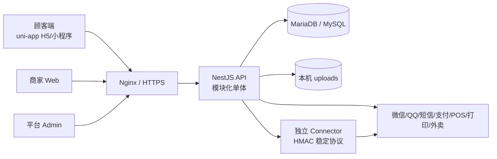
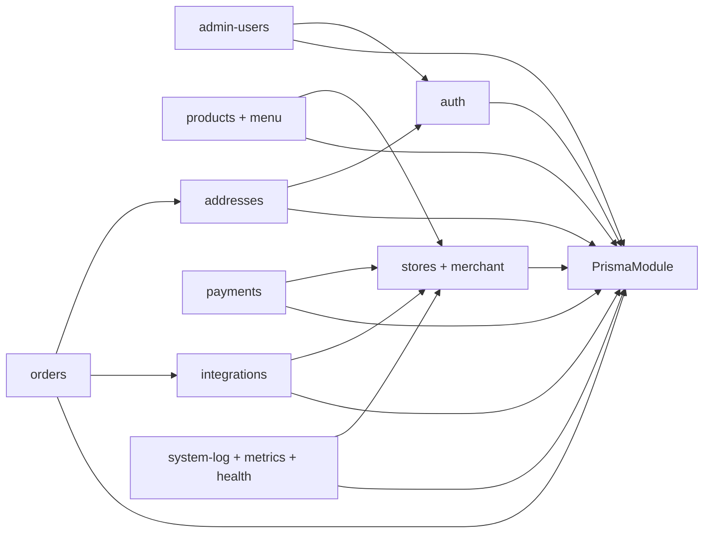
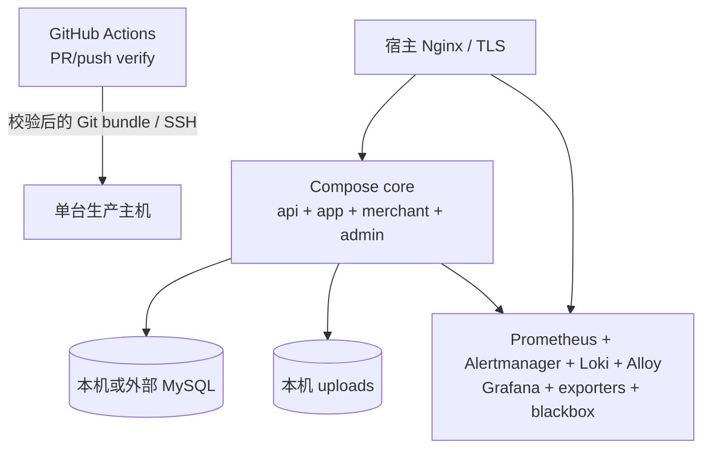

# LingDian 系统结构与架构边界

> 审查基线：2026-08-30 当前工作区。本文只描述仓库中已经存在的运行结构；模块成熟度见 [模块目录](./12-module-catalog.md)，上线约束见 [权限与缺口分析](./13-permission-and-gap-analysis.md)，本轮问题与修复证据见 [代码库全面审查](./14-codebase-review-2026-08-30.md)。

## 1. 架构结论

LingDian 是 **pnpm monorepo 下的模块化单体**：顾客端、商家端和平台端共享一套 NestJS API、一个 MariaDB/MySQL 数据库及若干无状态基础包。支付、收银、打印和外卖厂商协议由 Connector 边界隔离，核心 API 不直接依赖厂商 SDK。

当前阶段继续保持模块化单体是合理选择。认证、订单、支付等需要同库事务的领域不应为了形式拆成网络服务；只有出现独立扩缩容、合规隔离、不同发布节奏或明确团队所有权时，才评估拆进程。

产品运行模式是单店：

- 生产固定 `STORE_MODE=single` 和 `PRIMARY_STORE_ID`；
- 顾客不选店，公开菜单、下单、支付账户和商家数据范围都由服务端解析到主门店；
- `Store` 及各业务表仍保留 `storeId`，用于数据完整性、审计和未来迁移，不代表当前支持多店经营；
- `CLOSED` / `RESTING` 是业务状态，不应让 liveness 失败；下单时再校验营业与服务方式。

## 2. 系统上下文



边界说明：

- 微信、QQ 登录和短信提供方由认证模块调用；
- 支付、POS、打印、美团、京东等通过 Connector 适配；真实厂商 SDK、资质和证书不在本仓库；
- 商品图片写入 API 主机的持久目录，不是对象存储；
- 三个前端生产产物都是静态文件，浏览器和小程序不持有商户密钥或业务授权决策。

## 3. Monorepo 目录与依赖规则

| 路径 | 主要职责 | 可依赖 | 不应承担 |
| --- | --- | --- | --- |
| `uniapp/` | 顾客菜单、规格、购物车、结算、订单、认证、地址 | contracts、icons、observability、common/theme | 商户密钥、服务端定价、权限判定 |
| `web/` | 商家单店工作台、商品配置、订单、集成开关 | contracts、icons、observability、common/theme | 平台治理、仅靠隐藏按钮授权 |
| `admin/` | 平台账号、系统日志、个人设置 | contracts、icons、observability、common/theme | 商家经营流程、直接访问数据库 |
| `backend/` | HTTP 边界、鉴权、业务规则、事务、状态机、Connector 调度 | db、contracts、common | 页面状态、厂商私有协议实现 |
| `packages/contracts/` | 跨端 API 与事件契约 | TypeScript 标准能力 | Prisma 模型、页面 ViewModel |
| `packages/db/` | Prisma schema、Client、迁移与迁移校验 | Prisma | HTTP DTO、业务用例 |
| `packages/observability/` | 客户端错误上报安装器 | 无业务依赖 | 业务日志查询、告警策略 |
| `packages/icons/` | 三端图标出口 | Vue/Lucide | 页面与业务逻辑 |
| `common/` | 响应码、无状态工具 | 无业务依赖 | 数据库和领域实体 |
| `theme/` | 管理端与小程序设计令牌 | 无业务依赖 | 页面专属布局 |
| `deploy/`、`.github/` | CI、镜像、Compose、Nginx、发布、备份和监控 | Docker/宿主环境 | 真实密钥、业务默认数据 |

依赖方向应保持为：

```text
clients ──> contracts / icons / observability / common / theme
backend ──> contracts / db / common
db、contracts、common ──X──> backend 或任一客户端
```

本轮新增源码门禁会检查生产源文件不超过 600 行，并拒绝相对导入、路径别名和 workspace 包形成的运行时循环依赖。类型导入不计入运行时环。

## 4. 后端模块边界



关键所有权：

- `auth` 拥有身份、会话、验证码、OAuth、法律同意与认证审计；
- `stores` / `merchant` 拥有主门店解析和商家 scope；
- `products` / `menu` 拥有分类、SPU、SKU、选择组和公开菜单；
- `orders` 拥有服务端报价快照、订单状态与订单 outbox 写入；
- `payments` 拥有支付意图、资金流水和验签回调；订单只有在支付域确认资金事实后进入在线 `PAID`；
- `integrations` 拥有可选 Connector 开关、可靠投递和重试；
- `system-log`、`metrics`、`health` 分别负责应用日志、Prometheus 指标与存活/就绪检查。

## 5. 核心数据流

### 5.1 认证与会话

1. 顾客使用手机号/微信/QQ，商家和平台使用账号密码；
2. API 按 `user-api`、`merchant-api`、`admin-api` audience 签发会话；
3. 每次登录创建新的 session ID，同设备已有活动会话被撤销，数据库保证每设备最多一条活动会话；
4. H5 通过 `HttpOnly` cookie 轮换 refresh token 并检测重放；微信/QQ 小程序不依赖 cookie 持久化，而是用新的 `uni.login` 平台码为已绑定且启用的 `USER` 身份创建新 session；显式退出或服务端拒绝后会阻断自动恢复；
5. 受保护请求同时校验 JWT、数据库 session、用户状态和 `sessionVersion`。

### 5.2 菜单、规格与下单

1. 顾客读取 `/api/menu/current`，服务端确定主门店；匿名 GET 不写演示数据；
2. 顾客端按默认活动 SKU 展示商品，并支持选择组的单选/多选、必选/可选和 min/max；
3. 购物车当前只在客户端内存中保存；
4. 下单时 API 重读门店、SKU、选择组、选项和地址，以整数分重新计价；
5. 订单、明细、选择快照、状态日志和可选 `order.created` outbox 在同一事务写入；
6. 当前库存数不阻断下单，优惠券也未参与计价。

### 5.3 支付

1. 顾客只能为自己、主门店内、未删除且待支付的订单创建幂等意图；
2. 数据库 `activeOrderKey` 保证一个订单最多一个活动支付尝试；订单终止、支付预占、成功确认和过期释放都遵守 order → intent 锁顺序；
3. Connector 同步响应只表示创建受理，不能直接成为支付成功事实；
4. Connector 验证厂商事件后，以 HMAC 回调 API；
5. API 核对账户、提供方、金额、币种、外部意图和事件幂等，并在事务中写 PaymentIntent、PaymentTransaction、Order 与状态日志；成功回调与取消串行化，乱序 `PROCESSING` 不会复活失败意图，迟到成功进入 `LATE_PAYMENT` 处置；
6. 过期活动意图不会仅按本地时间释放；新尝试前必须从 Connector 获得按 `payment_no` 串行化、带持久关单凭证的 `CLOSED` 结果，否则继续占用并进入人工核对；
7. 在线订单不能由通用订单接口手工标记 `PAID`、`REFUNDING` 或 `REFUNDED`。

该服务端底座仍未形成顾客端真实支付、退款、主动查单、定时超时 worker 和对账闭环，详见 [支付交易与订单模块设计](./10-payment-order-architecture.md)。

### 5.4 外部集成

1. 订单事务按部署级和门店级开关写 `integration_outbox`；
2. API 内轮询器原子认领，失败指数退避，最多 8 次后进入死信；
3. Connector 将稳定事件翻译成 POS、打印或外卖平台协议；
4. 当前只有 `order.created` 出站事件，没有入站状态、死信运营界面或人工重放入口。

## 6. 信任与数据边界

| 边界 | 服务端必须重新校验 | 当前状态 |
| --- | --- | --- |
| 顾客端 → API | audience、用户归属、主门店、SKU/选项、价格、地址、订单状态 | 主链已校验；真实支付、库存与优惠未闭环 |
| 商家端 → API | `MERCHANT`、主门店 scope、对象归属、领域状态 | 门店 scope 已实现；动作级权限缺失 |
| 平台端 → API | 管理层级、目标账号层级、敏感动作 | 固定角色和层级有效；商品/订单仍是宽 `ADMIN` |
| API → DB | 事务、唯一约束、条件更新、状态日志 | 核心交易具备事务/条件更新；统一业务审计仍缺 |
| API → Connector | HTTPS URL、HMAC、超时、幂等、重试 | 出站主链已实现；死信运营与双向事件缺失 |
| Connector → API | raw body、时间戳、nonce、签名、账户与资金字段 | 支付回调底座已实现；真实厂商 E2E 未验收 |
| 客户端 → 日志 | source/audience、速率、大小、脱敏 | 已有限流和脱敏；缺跨服务 trace |

## 7. 运行、发布与可观测性



仓库内已有的发布保障：

- PR、`main` push 和手动触发共用 verify；PR 不执行生产 deploy；
- verify 使用 MySQL 8.4 空库完整重放 Prisma 迁移，并运行部署契约、测试、类型检查、构建、Dockerfile/Compose 和脚本语法校验；
- 发布使用校验过的不可变 Git bundle 和完整 SHA；生产 job 绑定 GitHub `production` environment；
- 默认迁移前备份数据库与 uploads；迁移前先停止 API 写入，迁移失败时核心服务保持停止，等待 roll-forward 或恢复已验证备份；
- `api + app + merchant + admin` 作为一组激活和健康检查；激活失败时只有上一 release 与目标 release 的完整 Prisma 迁移树逐字节一致才自动恢复，否则停止核心服务并要求人工处置；
- liveness 与 readiness 分离，readiness 校验数据库和主门店；
- 完整观测栈包含 API/主机/容器指标、集中日志、公网探测、dashboard、告警和保留策略；Grafana、Prometheus、Alertmanager 只绑定 `127.0.0.1`，公网 `/api/metrics` 被 Nginx 阻断。

仍然存在的运行边界：

- 单主机仍是故障域，数据库和 uploads 的默认备份也在本机；必须异机复制并做恢复演练；
- uploads 是本机目录，不具备对象存储的多副本与跨主机恢复能力；
- 应用回滚不会自动反向执行数据库迁移，迁移历史不完全一致时会在激活前拒绝且保持当前服务不变；需要依靠 expand/contract、roll-forward 和经演练的备份恢复；
- 同机监控无法发现整机断电，仍需异地 uptime 探测；
- readiness 尚未覆盖迁移漂移、上传盘空间和所有 Connector。

生产操作以 [部署 Runbook](../deploy/README.md) 和 [可观测性说明](../deploy/observability/README.md) 为准。

## 8. 架构守则

1. 金额、权限、订单状态、库存和退款事实以服务端实现与数据库不变量为准。
2. Controller 做协议和身份边界；service 做领域规则；Prisma 查询必须携带 owner/store scope。
3. 幂等快捷路径不得位于对象授权之前；并发不变量优先落数据库唯一键或条件更新。
4. 运行时依赖只能沿既定方向流动，不用 barrel 文件形成互相引用。
5. 生产源码单文件默认不超过 600 行；超过阈值应按查询、命令、策略、映射或组件拆分。迁移、schema、声明式配置和测试按可读性单独评估。
6. 静态页面不能以模拟数字伪装真实能力；未闭环模块默认 feature flag 关闭。
7. 任何新模块必须同时补契约、鉴权、异常语义、测试、模块目录和上线风险说明。
8. 迁移只前向演进；发布前备份不能替代隔离恢复演练和向后兼容设计。
