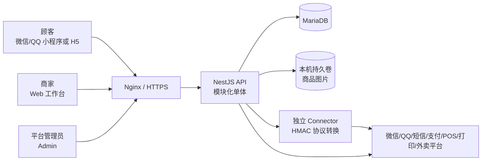
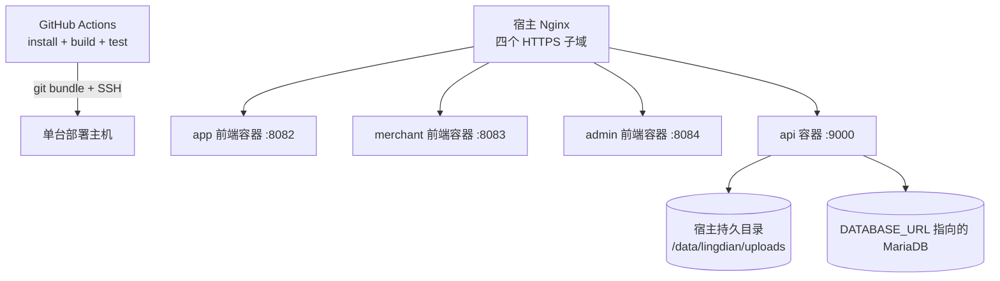
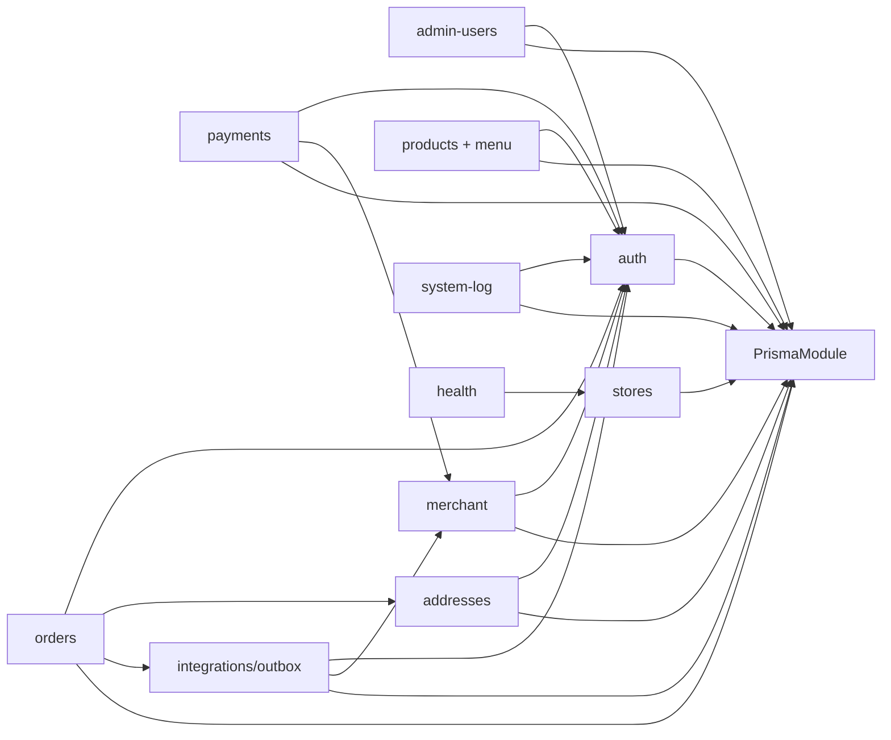

# LingDian 系统结构与架构边界

> 审查基线：2026-08-29 当前工作区。本文描述代码中真实存在的结构；产品愿景与未实现能力统一在 [模块目录](./12-module-catalog.md) 和 [权限与缺口分析](./13-permission-and-gap-analysis.md) 中标记，不把页面壳或 PRD 目标当作已上线能力。

## 1. 架构结论

LingDian 当前是一个 **pnpm monorepo 下的模块化单体**：三个 Vue 客户端共享一套 NestJS API、MariaDB 数据库和基础包，收银、打印、外卖、支付厂商通过独立连接器隔离易变协议。

这个方向适合当前阶段，建议继续保持模块化单体，不急于拆微服务。当前主要问题不是进程数量，而是以下业务边界尚未闭合：

1. 唯一生产门店已经通过配置和运行时 resolver 固化，但门店资料/营业设置编辑能力仍未完成；
2. 支付域已建立服务端基础，但消费者端仍使用现金与“模拟支付”，退款和对账未闭环；
3. 库存字段存在，但没有预占、确认、释放和盘点流水；
4. 权限只有角色和门店范围，没有商家员工、岗位、动作级权限与统一后端策略；
5. 大量商家端页面是静态样例，不能作为真实经营能力使用。

因此，当前成熟度应定义为：**具备认证、商品配置、基础下单、订单管理和连接器基础的 MVP 工程骨架，尚未达到单店真实在线交易的生产闭环。**

### 1.1 单店运营决策

当前产品不建设选店、品牌/组织层级、跨店购物车、跨店库存调拨和跨店报表。顾客端不需要传入或选择门店，但服务端必须确定性解析唯一生产门店：

1. 生产环境显式配置 `STORE_MODE=single` 和 `PRIMARY_STORE_ID`；
2. 启动/readiness 校验数据库可达且该门店存在；`CLOSED`/`RESTING` 是正常业务状态，不导致基础设施失活；
3. `/stores/current`、`/menu/current` 只读取该门店，空库不得由 GET 创建演示数据；
4. 顾客下单由服务端注入该门店；兼容期若仍接收 `storeId`，必须拒绝与配置不一致的值；
5. 商家账号的门店范围固定为该门店，但继续保留 Store 外键和服务端 scope 校验。

保留 `Store` 和各业务表的 `storeId` 并不意味着建设多门店，它仍用于收款账户归属、审计、数据完整性和未来迁移。商家端已改为单个“门店设置”页面，不提供创建/切换门店。

## 2. 系统上下文



说明：

- 微信、QQ 登录和短信提供方目前由认证模块直接调用；
- 支付、POS、打印、美团、京东等厂商协议放入 Connector，核心 API 只处理稳定契约和 HMAC；
- Connector 代码与真实厂商 SDK 不在本仓库，因此仓库中的“支持”表示协议入口已准备，不表示厂商生产资质、证书和端到端验收已经完成；
- 商品图片当前写入 API 主机挂载目录，不是对象存储。

## 3. 运行与部署拓扑



当前发布流程具备提交级构建验证、部署目标识别、候选容器健康检查和单容器启动失败回滚；但仍存在以下发布边界：

- 工作流只在 push `main` 或手动触发时运行，没有 PR 级工作流和真实数据库迁移验证；
- 多目标发布会先逐个切换三个前端，最后切换 API；后续步骤失败不会回滚已经切换的其他容器，可能形成前后端版本分裂；
- 数据库迁移发生在 API 候选健康检查之前，仓库内没有可验证的迁移前备份/恢复门禁；
- 仍是单主机部署，缺少对象存储、集中指标告警、灾备与高可用编排。

`GET /api/health` 与 `/api/health/live` 只证明进程可响应，属于 liveness。`GET /api/health/ready` 已通过 `StoreContextResolver` 检查数据库可达且 `PRIMARY_STORE_ID` 对应门店存在；它仍不检查迁移漂移、磁盘/上传目录或 Connector，因此只是当前阶段的基础 readiness。

现有 Prisma 迁移历史也不是空库完整基线：最早的迁移明确针对既有数据库，门店、商品、SKU、订单等核心表没有对应初始建表迁移，后续迁移已直接 `ALTER orders`。因此新环境或灾备恢复不能只靠当前 `prisma migrate deploy` 重建系统。

## 4. Monorepo 目录与职责

| 路径 | 真实职责 | 允许依赖 | 不应承担 |
| --- | --- | --- | --- |
| `uniapp/` | 顾客端菜单、购物车、结算、订单、认证、资料与地址 | contracts、icons、observability、theme/common | 商户密钥、服务端定价、权限决策 |
| `web/` | 商家工作台；当前真实能力主要是商品配置、订单、集成开关 | contracts、icons、observability、theme/common | 平台全局管理、仅靠菜单隐藏授权 |
| `admin/` | 平台账号、系统日志、个人设置 | contracts、icons、observability、theme/common | 商家经营页面、直接访问数据库 |
| `backend/` | HTTP 边界、鉴权、业务规则、事务、状态机、Connector 调度 | db、contracts、common | 页面状态、厂商私有 SDK |
| `packages/contracts/` | API 与跨进程事件的稳定类型 | TypeScript 标准能力 | Prisma 实体、页面 ViewModel |
| `packages/db/` | Prisma schema、Client 与迁移 | Prisma | 业务用例、HTTP DTO |
| `packages/observability/` | 客户端错误上报协议与安装器 | 无业务依赖 | 业务日志查询或告警系统 |
| `packages/icons/` | 三端图标导出边界 | Vue/Lucide | 页面逻辑 |
| `common/` | 响应码与无状态工具 | 无业务依赖 | 领域实体和数据库访问 |
| `theme/` | 管理端和小程序设计令牌 | 无业务依赖 | 页面专有布局 |
| `deploy/`、`.github/` | 构建、Nginx、发布脚本 | Docker/宿主环境 | 业务配置默认值或真实密钥 |

## 5. 后端组件关系



### 5.1 当前合理边界

- 认证按 `user-api`、`merchant-api`、`admin-api` 三个 audience 隔离；
- 顾客订单和地址使用 `userId` 做对象归属；
- 商家订单、商品、集成和支付账户查询使用 JWT 内的 `merchantStoreIds` 做门店范围；
- 订单在服务端重新读取 SKU、选项和价格，客户端金额不作为资金事实；
- 第三方下单事件与订单在同一事务写入 outbox；
- 支付账户只保存部署密钥引用，不保存厂商私钥、证书或 API Key。

### 5.2 需要收紧的边界

- `products.service.ts` 同时承担查询、命令、配置同步、校验和缓存，已成为大服务；
- `admin/merchants` 与 `admin/users` 存在重叠的商家账号管理入口；
- outbox worker、日志清理等后台任务跟随 API 进程运行，缺少独立 worker、任务监控和人工重放入口；
- 业务审计分散在认证审计、订单状态日志和系统错误日志中，没有统一的不可抵赖业务审计域。

## 6. 信任边界

| 边界 | 可信输入 | 必须重新校验 | 当前状态 |
| --- | --- | --- | --- |
| 顾客端 → API | access token、用户操作意图 | 用户归属、门店状态、SKU/选项、价格、地址归属、订单状态 | 主体已实现；门店服务模式与规格 UI 尚不完整 |
| 商家端 → API | merchant audience token | 角色、门店范围、对象所属门店、动作权限 | 门店范围已实现；动作级权限缺失 |
| 平台端 → API | admin audience token | 管理员层级、目标账号层级、敏感动作权限 | 账号层级已实现；商品/订单等仍是宽角色授权 |
| API → 数据库 | 服务端用例参数 | 事务、唯一约束、条件更新、审计 | 核心交易使用事务；迁移基线与数据生命周期不足 |
| API → Connector | 版本事件、HMAC | URL/TLS、超时、重试、响应状态 | outbox 主链已实现；死信运营与双向事件缺失 |
| Connector → 支付回调 | raw body、时间戳、nonce、签名 | 账户、提供方、金额、币种、交易号、幂等 | 服务端基础已实现；真实厂商与退款/对账未验收 |
| 浏览器/小程序 → 日志 | 有界客户端错误 | audience/source、一致性、速率、脱敏 | 已实现基础限制；没有 trace/request ID 串联 |

## 7. 核心数据流

### 7.1 登录与会话

1. 顾客使用手机号/微信/QQ，商家和平台使用账号密码；
2. API 创建带 audience 的服务端 session，短期 access token 返回客户端；
3. refresh token 只通过 `HttpOnly` cookie 给浏览器，小程序使用受控刷新流程；
4. 每次受保护请求校验 JWT、session 状态、用户状态和 `sessionVersion`；
5. 密码修改、账号停用、角色或门店范围变化会撤销会话。

### 7.2 菜单到订单

1. 顾客端读取 `GET /api/menu/current`；
2. 服务端通过 `StoreContextResolver` 精确读取 `PRIMARY_STORE_ID`；顾客端无需选店，旧客户端传入相同 `storeId` 仍兼容；
3. 购物车只保存在当前前端进程内；
4. 提交时 API 重新读取门店、SKU、商品状态、选择组和价格；
5. API 在一个事务内创建订单、明细、选择项快照、状态日志和可选 outbox 事件；
6. 当前不预占或扣减库存，`couponCode` 也未参与计价。

### 7.3 支付

1. 顾客为自己的待支付订单创建幂等 PaymentIntent；
2. API 按订单门店、provider 和 channel 查找收款账户；
3. Connector 调用真实厂商；
4. Connector 验证厂商后，以 HMAC 回调核心 API；
5. API 校验金额、币种、账户、外部意图和事件幂等后写资金流水，并以条件更新推进订单；
6. 当前顾客端没有调用这条链路，退款、主动查单和日终对账尚未实现。

详细协议见 [支付交易与订单模块设计](./10-payment-order-architecture.md)。

### 7.4 第三方订单事件

1. 订单事务按部署级与门店级开关写 `integration_outbox`；
2. API 进程内轮询器原子认领事件；
3. 失败指数退避，最多 8 次，之后进入死信；
4. Connector 用稳定事件翻译成 POS、打印或外卖平台协议；
5. 当前只有 `order.created` 出站事件，没有支付成功、接单/拒单、备餐、配送、打印结果等双向状态同步。

## 8. 数据域

| 数据域 | 主要实体 | 当前归属 | 关键缺口 |
| --- | --- | --- | --- |
| 门店 | `Store` | stores/merchant/products | 已由 `PRIMARY_STORE_ID` 固化唯一运行门店；仍缺门店资料/营业设置编辑；桌台/二维码仅在堂食需要时建设 |
| 商品 | `Category`、`Product`、`ProductSKU`、选择组/选项/绑定 | products/menu | 商家创建与上下架入口、并发版本、服务拆分 |
| 交易订单 | `Order`、`OrderItem`、`OrderItemSelection`、`OrderStatusLog` | orders | 超时任务、客户取消、真实优惠、库存预占、履约单 |
| 支付 | `PaymentAccount`、`PaymentIntent`、`PaymentTransaction`、`PaymentWebhookEvent` | payments | 前端支付、退款、主动查单、日终对账、差错工单 |
| 用户与认证 | `User`、身份、密码、角色、session、验证码、OAuth、法律同意 | auth/admin-users | 注销/删除、岗位权限、生命周期清理、审计查询 |
| 地址 | `UserAddress`、订单地址快照 | addresses/orders | 地址编辑、数据权利/删除策略 |
| 外部集成 | `StoreIntegration`、`IntegrationOutbox` | integrations | 入站事件、死信 UI/重放、PII 留存策略 |
| 运维日志 | `SystemLog`、`AuthAuditLog` | system-log/auth | request ID、指标/追踪/告警、统一业务审计 |

## 9. 目标模块边界

建议保持一个 API 仓库，但把增长最快的能力拆成清晰的应用模块和后台 worker：

```text
identity-access/       认证、会话、角色、岗位、权限策略
store-operations/     唯一门店、员工归属、营业配置
catalog/              分类、SPU、SKU、选项、菜单发布
cart-pricing/          服务端报价、促销试算、价格快照
ordering/              下单幂等、订单状态、客户操作
inventory/             可售库存、预占、释放、流水
payment/               收款、退款、查单、对账、差错
fulfillment/           堂食桌台、取餐号、备餐、配送
membership-marketing/ 会员、积分、券、活动
integration/           outbox/inbox、Connector、死信
audit-observability/   业务审计、日志、指标、追踪、告警
worker/                超时、重试、清理、对账、通知
```

不建议把这些模块立即拆成独立网络服务。先通过目录、端口接口、事务所有权和测试边界完成模块化；只有出现独立扩缩容、合规隔离、不同发布节奏或团队所有权时，再拆进程。

## 10. 架构守则

后续修改应遵守以下约束：

1. 权限在 controller/guard 和 service 查询范围两层强制，前端隐藏只改善体验；
2. 所有涉及金额、库存、优惠、收款方和状态流转的事实由服务端计算；
3. 商家请求不得把客户端 `storeId` 直接当成授权依据；
4. 顾客菜单和下单必须由服务端解析同一个已配置生产门店，客户端不得决定门店归属；
5. 订单状态不替代资金状态、库存状态或履约状态；
6. 外部协议只能进入 adapter/connector，不在订单服务中增加厂商分支；
7. 写模型变更必须有迁移、幂等策略、审计记录和失败补偿；
8. 后台任务必须可观测、可重试、可人工处置，不能只依赖内存定时器；
9. PRD、页面导航和代码实现分别标记目标、骨架与已完成状态；
10. 每次新增模块同步更新本文、模块目录和权限矩阵。
