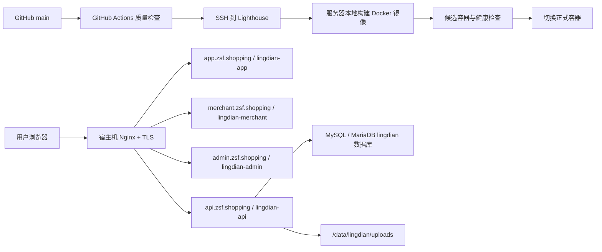

# LingDian 在 zsf.shopping 的 Lighthouse 部署文档

## 文档状态

- 状态：部署方案已确认，尚未执行。
- 日期：2026-07-27。
- 仓库：`git@github.com:ZhangNoName/LingDian.git`。
- 发布分支：`main`。
- 目标服务器：与 `sun-world` 相同的腾讯云 Lighthouse，公网 IPv4 为 `81.70.43.189`。
- 参考方案：`sun-world` 的 GitHub Actions、SSH、服务器本地 Docker 构建、候选容器健康检查和失败回滚流程。

本文是后续实施和运维的唯一部署基线。本文落库不代表已经修改 DNS、服务器、Nginx、GitHub Secrets 或生产数据库。

## 1. 范围与非目标

本次方案覆盖以下服务：

- UniApp H5 用户端。
- 商家 Web。
- 平台管理后台。
- NestJS API。
- Prisma 生产迁移。
- GitHub Actions 自动部署。
- Nginx、TLS、健康检查、回滚和运维验证。

本次不包含：

- `zsf.shopping` 官网的设计和开发。
- 微信、QQ 等小程序的上传、审核和发布。
- DNS、服务器或 GitHub 仓库的实际改动。
- 生产数据库的实际创建、迁移或初始化。

## 2. 已确认的域名规划

| 域名 | 用途 | 本次是否部署 | 上游服务 |
| --- | --- | --- | --- |
| `zsf.shopping` | 未来官网 | 否，保留现状 | 暂无 |
| `www.zsf.shopping` | 未来官网别名 | 否，未来跳转到根域名 | 暂无 |
| `app.zsf.shopping` | UniApp H5 用户端 | 是 | `lingdian-app:80` |
| `merchant.zsf.shopping` | 商家 Web | 是 | `lingdian-merchant:80` |
| `admin.zsf.shopping` | 平台管理后台 | 是 | `lingdian-admin:80` |
| `api.zsf.shopping` | NestJS API、上传文件和 Swagger | 是 | `lingdian-api:9000` |

当前已确认 `zsf.shopping` 和 `www.zsf.shopping` 的 A 记录指向 `81.70.43.189`。`app`、`merchant`、`admin` 和 `api` 子域名在执行部署前需要新增解析。

## 3. 推荐生产拓扑



生产流量只进入宿主机 Nginx。所有应用端口仅绑定到 `127.0.0.1`，不直接暴露到公网。LingDian 与 `sun-world` 使用不同目录、锁文件、镜像、容器、端口、环境文件和数据目录。

## 4. 服务器资源与隔离约定

### 4.1 路径

| 资源 | 固定路径 |
| --- | --- |
| 代码仓库 | `/home/lighthouse/apps/lingdian` |
| API 生产环境变量 | `/home/lighthouse/.config/lingdian/api.env` |
| 持久化上传目录 | `/data/lingdian/uploads` |
| 部署锁 | `/tmp/lingdian-docker-deploy.lock` |
| Nginx 站点配置 | `/etc/nginx/sites-available/lingdian.conf` |
| Nginx 启用链接 | `/etc/nginx/sites-enabled/lingdian.conf` |

环境文件权限固定为所有者读写：

```bash
sudo install -d -m 700 -o lighthouse -g lighthouse /home/lighthouse/.config/lingdian
sudo install -m 600 -o lighthouse -g lighthouse /dev/null /home/lighthouse/.config/lingdian/api.env
sudo install -d -m 750 -o lighthouse -g lighthouse /data/lingdian/uploads
```

### 4.2 镜像和容器

| 服务 | 镜像名 | 正式容器 | 正式宿主端口 | 候选宿主端口 |
| --- | --- | --- | --- | --- |
| UniApp H5 | `lingdian-app:<git-sha>` | `lingdian-app` | `127.0.0.1:8082` | `127.0.0.1:18082` |
| 商家 Web | `lingdian-merchant:<git-sha>` | `lingdian-merchant` | `127.0.0.1:8083` | `127.0.0.1:18083` |
| 管理后台 | `lingdian-admin:<git-sha>` | `lingdian-admin` | `127.0.0.1:8084` | `127.0.0.1:18084` |
| API | `lingdian-api:<git-sha>` | `lingdian-api` | `127.0.0.1:9000` | `127.0.0.1:19000` |

表中的 `<git-sha>` 由部署工作流替换为每次发布的完整提交 SHA，不是人工填写的固定值。

执行前必须运行下面的只读检查，确认端口未被现有服务占用：

```bash
sudo ss -lntp | grep -E ':(8082|8083|8084|9000|18082|18083|18084|19000)\b' || true
```

如果正式端口已占用，先更新本文、Nginx 配置和自动部署检查脚本，再实施；不得临时改端口造成文档与生产不一致。

## 5. DNS 与 TLS

### 5.1 DNSPod 记录

域名记录通过[腾讯云 Lighthouse 域名管理](https://console.cloud.tencent.com/lighthouse/domain/detail?id=zsf.shopping&domainId=lhdo-9l5vhwqp&effectiveDNS=tess.dnspod.net,paint.dnspod.net&dnsState=NORMAL)维护。

保留根域名和 `www` 的现有记录，新增以下 A 记录：

| 主机记录 | 类型 | 值 | 建议 TTL |
| --- | --- | --- | --- |
| `app` | A | `81.70.43.189` | 600 秒 |
| `merchant` | A | `81.70.43.189` | 600 秒 |
| `admin` | A | `81.70.43.189` | 600 秒 |
| `api` | A | `81.70.43.189` | 600 秒 |

不使用通配符 DNS。新增记录后分别执行：

```bash
dig +short app.zsf.shopping A
dig +short merchant.zsf.shopping A
dig +short admin.zsf.shopping A
dig +short api.zsf.shopping A
```

四个结果均应为 `81.70.43.189`。

### 5.2 TLS 证书

先启用 HTTP Nginx 配置并通过 `nginx -t`，再使用服务器现有的 Certbot 申请证书：

```bash
sudo certbot --nginx \
  -d app.zsf.shopping \
  -d merchant.zsf.shopping \
  -d admin.zsf.shopping \
  -d api.zsf.shopping
```

证书签发成功后验证续期：

```bash
sudo certbot renew --dry-run
```

在 HTTPS 可用之前不得把 OAuth 回调地址切换到生产域名，也不得启用生产 Cookie。

## 6. 服务器首次准备

服务器需要已安装并可用：

- Git。
- Docker Engine。
- Nginx。
- Certbot 及 Nginx 插件。
- `curl`、`flock`、`dig`。
- 能够只读拉取 `ZhangNoName/LingDian` 的 GitHub deploy key。
- 一个可供 LingDian 独立使用的 MySQL/MariaDB 数据库和最小权限账号。

首次克隆使用：

```bash
sudo install -d -m 755 -o lighthouse -g lighthouse /home/lighthouse/apps
git clone git@github.com:ZhangNoName/LingDian.git /home/lighthouse/apps/lingdian
cd /home/lighthouse/apps/lingdian
git checkout main
git pull --ff-only origin main
```

服务器仓库只作为受控构建工作区。部署脚本遇到未提交修改时必须停止，不能自动丢弃、覆盖、合并或变基服务器文件。

## 7. API 生产配置

`/home/lighthouse/.config/lingdian/api.env` 只保存在服务器，不进入 Git、构建日志、GitHub Artifact 或 Docker 镜像。

### 7.1 必需配置组

基础配置：

```text
NODE_ENV=production
PORT=9000
DATABASE_URL
AUTH_JWT_ACCESS_SECRET
AUTH_REFRESH_PEPPER
AUTH_ACCESS_TOKEN_TTL_SECONDS=900
AUTH_REFRESH_TOKEN_TTL_DAYS=30
AUTH_COOKIE_SECURE=true
CORS_ALLOWED_ORIGINS=https://app.zsf.shopping,https://merchant.zsf.shopping,https://admin.zsf.shopping
```

当前 API 在代码中固定使用 `/api` 全局前缀；部署流程不依赖 `API_PREFIX` 环境变量。

第三方登录和短信配置：

```text
SMS_PROVIDER
WECHAT_APP_ID
WECHAT_APP_SECRET
WECHAT_REDIRECT_URI
WECHAT_MINI_APP_ID
WECHAT_MINI_APP_SECRET
QQ_APP_ID
QQ_APP_KEY
QQ_REDIRECT_URI
QQ_MINI_APP_ID
QQ_MINI_APP_SECRET
```

生产启动前必须满足代码中的环境校验：

- `AUTH_JWT_ACCESS_SECRET` 和 `AUTH_REFRESH_PEPPER` 各不少于 32 个随机字符。
- `DATABASE_URL` 使用 `mysql://`。
- `AUTH_COOKIE_SECURE=true`。
- `SMS_PROVIDER` 必须是已经在代码中注册的生产提供方，不能使用 `console`。
- 微信与 QQ 的 Web、Mini App 配置必须完整。
- Web OAuth 回调地址必须是绝对 HTTPS URL，并与第三方平台登记值完全一致。

如果短信生产提供方尚未接入，当前代码会拒绝以 `NODE_ENV=production` 启动。这是上线阻断条件，不能通过降低环境级别绕过。

### 7.2 初始化账号

以下变量仅在首次初始化管理员和商家账号时临时写入环境文件：

```text
AUTH_BOOTSTRAP_SUPER_ADMIN_USERNAME
AUTH_BOOTSTRAP_SUPER_ADMIN_PASSWORD
AUTH_BOOTSTRAP_SUPER_ADMIN_PHONE
AUTH_BOOTSTRAP_MERCHANT_USERNAME
AUTH_BOOTSTRAP_MERCHANT_PASSWORD
AUTH_BOOTSTRAP_MERCHANT_PHONE
AUTH_BOOTSTRAP_MERCHANT_STORE_IDS
```

初始化完成并验证登录后立即从环境文件删除这些变量，再重启 API。不得把真实账号或密码写进本文、GitHub Secrets 说明、部署日志或命令历史。

### 7.3 上传目录

API 从进程工作目录下的 `uploads` 提供 `/uploads/` 静态文件。Docker 实现时必须把 `/data/lingdian/uploads` 挂载到容器内 API 工作目录的 `uploads`，确保更换容器不会丢失商品图片。

## 8. 前端生产配置

三个前端都使用统一 API 地址：

```text
VITE_API_BASE=https://api.zsf.shopping/api
```

前端的认证与业务请求必须全部通过该构建变量生成 URL，不能在生产代码中直接请求
当前站点的相对 `/api` 路径。临时联调环境可以用 `NODE_ENV=development` 和
`SMS_PROVIDER=console` 启动 API，但仍须设置 `AUTH_COOKIE_SECURE=true`，并将
`CORS_ALLOWED_ORIGINS` 限制为实际使用的 HTTPS 站点。API 与 MariaDB 容器统一加入
`lingdian-network` 私有 Docker 网络，数据库端口不映射到公网。

构建产物和站点对应关系：

| 项目 | 构建命令 | 生产站点 |
| --- | --- | --- |
| `uniapp/` | `corepack pnpm --filter @lingdian/uniapp build:h5` | `app.zsf.shopping` |
| `web/` | `corepack pnpm --filter @lingdian/web build` | `merchant.zsf.shopping` |
| `admin/` | `corepack pnpm --filter @lingdian/admin build` | `admin.zsf.shopping` |

每个静态镜像使用独立 Nginx 站点，必须配置 SPA fallback：

```nginx
location / {
    try_files $uri $uri/ /index.html;
}
```

不得把 `localhost:9000` 编译进生产前端。构建后自动检查产物中不存在 `localhost`、`127.0.0.1` 或测试 API 地址。

## 9. 宿主机 Nginx 规划

下面是实施时的目标结构。证书路径由 Certbot 写入，首次启用时先保留 HTTP server，再让 Certbot 完成 HTTPS 配置。

```nginx
server {
    listen 80;
    server_name app.zsf.shopping;

    location / {
        proxy_pass http://127.0.0.1:8082;
        proxy_set_header Host $host;
        proxy_set_header X-Real-IP $remote_addr;
        proxy_set_header X-Forwarded-For $proxy_add_x_forwarded_for;
        proxy_set_header X-Forwarded-Proto $scheme;
    }
}

server {
    listen 80;
    server_name merchant.zsf.shopping;

    location / {
        proxy_pass http://127.0.0.1:8083;
        proxy_set_header Host $host;
        proxy_set_header X-Real-IP $remote_addr;
        proxy_set_header X-Forwarded-For $proxy_add_x_forwarded_for;
        proxy_set_header X-Forwarded-Proto $scheme;
    }
}

server {
    listen 80;
    server_name admin.zsf.shopping;

    location / {
        proxy_pass http://127.0.0.1:8084;
        proxy_set_header Host $host;
        proxy_set_header X-Real-IP $remote_addr;
        proxy_set_header X-Forwarded-For $proxy_add_x_forwarded_for;
        proxy_set_header X-Forwarded-Proto $scheme;
    }
}

server {
    listen 80;
    server_name api.zsf.shopping;
    client_max_body_size 20m;

    location / {
        proxy_pass http://127.0.0.1:9000;
        proxy_http_version 1.1;
        proxy_set_header Host $host;
        proxy_set_header X-Real-IP $remote_addr;
        proxy_set_header X-Forwarded-For $proxy_add_x_forwarded_for;
        proxy_set_header X-Forwarded-Proto $scheme;
        proxy_read_timeout 60s;
    }
}
```

每次修改后必须执行：

```bash
sudo nginx -t
sudo systemctl reload nginx
```

不得修改或覆盖 `sun-world` 的 Nginx 站点文件。

## 10. GitHub 仓库配置

### 10.1 Actions Variables

在 `ZhangNoName/LingDian` 仓库配置：

| 名称 | 值 |
| --- | --- |
| `LIGHTHOUSE_HOST` | `81.70.43.189` |
| `LIGHTHOUSE_USER` | `lighthouse` |
| `LIGHTHOUSE_PORT` | `22` |
| `LINGDIAN_REPO_DIR` | `/home/lighthouse/apps/lingdian` |

如果服务器实际 SSH 端口或用户不同，先修改本文中的固定约定，再配置仓库变量。

### 10.2 Actions Secrets

只配置：

- `LIGHTHOUSE_SSH_KEY`：只允许访问该服务器部署账号的私钥。

API 业务密钥默认不进入 GitHub。它们保存在服务器的 `api.env`，Actions 仅触发受控部署。SSH 公钥应限制来源、账号权限和可执行范围；部署账号通过精确 sudoers 规则获得所需的 Docker、Nginx 查询和服务重载权限，不授予无密码全量 root。

## 11. 自动部署工作流设计

后续实施文件为 `.github/workflows/deploy.yml`，行为必须满足以下约束。

### 11.1 触发方式

- Pull Request：只执行检查和构建验证，不接触生产服务器。
- Push 到 `main`：检测部署目标，检查通过后自动部署。
- `workflow_dispatch`：支持重新部署指定提交或指定服务。
- 仅 Markdown 和 `docs/**` 变化时不部署生产。
- 使用固定 production concurrency group，并设置 `cancel-in-progress: true`。

### 11.2 变更检测

| 变化路径 | 受影响目标 |
| --- | --- |
| `uniapp/**` | App H5 |
| `web/**` | 商家 Web |
| `admin/**` | 管理后台 |
| `backend/**`、`packages/db/**` | API |
| `packages/common/**`、`packages/contracts/**`、`packages/icons/**`、`packages/observability/**` | 引用该包的所有相关目标 |
| 根 `package.json`、锁文件、workspace 配置 | 全部目标 |
| `docs/**`、纯 Markdown | 不部署 |

检测结果必须显式输出 `app_changed`、`merchant_changed`、`admin_changed`、`api_changed` 和 `any_changed`。

### 11.3 质量门禁

工作流使用仓库声明的 `pnpm@11.7.0`，不得使用 `sun-world` 的 pnpm 版本。最低检查集合：

```bash
corepack pnpm install --frozen-lockfile
corepack pnpm --filter @lingdian/api test
corepack pnpm --filter @lingdian/admin test
corepack pnpm --filter @lingdian/admin build
corepack pnpm --filter @lingdian/web test
corepack pnpm --filter @lingdian/web build
corepack pnpm --filter @lingdian/uniapp test
corepack pnpm --filter @lingdian/uniapp type-check
corepack pnpm --filter @lingdian/uniapp build:h5
corepack pnpm --filter @lingdian/observability build
corepack pnpm --filter @lingdian/observability test
```

任一检查失败时不得 SSH 到服务器或更新容器。

### 11.4 服务器构建

Actions 通过 SSH 在服务器执行以下受控流程：

1. 使用 `/tmp/lingdian-docker-deploy.lock` 和 `flock` 取得独占锁。
2. 检查服务器仓库无未提交修改。
3. `git fetch --prune origin main`。
4. `git checkout main`。
5. `git pull --ff-only origin main`。
6. 校验服务器 `HEAD` 与 Actions 的目标 Git SHA 完全一致。
7. 仅为发生变化的目标构建以完整 Git SHA 标记的镜像。
8. 记录切换前每个正式容器使用的旧镜像标签。

不得在服务器自动执行 `git reset --hard`、强制切分支、合并或变基。

### 11.5 数据库迁移

API 变化时，在候选 API 启动前执行：

```bash
corepack pnpm run db:migrate:deploy
```

实际执行应在新 API 镜像的一次性容器中完成，并通过只读挂载或 `--env-file` 读取服务器生产环境变量。禁止在生产使用 `db:push`。

迁移前必须：

- 确认最新数据库备份可恢复。
- 输出待执行迁移列表。
- 确认迁移与当前正式版本向后兼容，允许旧容器在短暂切换窗口继续工作。

Prisma 迁移是前向操作。应用镜像回滚不会自动撤销数据库结构，迁移回滚必须按第 13 节单独处理。

### 11.6 候选容器

新镜像先在候选端口启动：

- App：`18082`。
- 商家 Web：`18083`。
- 管理后台：`18084`。
- API：`19000` 映射容器内 `9000`。

候选检查：

```bash
curl -fsSI http://127.0.0.1:18082/
curl -fsSI http://127.0.0.1:18083/
curl -fsSI http://127.0.0.1:18084/
curl -fsS http://127.0.0.1:19000/api/health
```

API 候选容器使用与正式容器相同的 `api.env` 和上传卷，但不得接收公网流量。任一检查失败时输出 `docker inspect` 和最近 120 行容器日志，删除候选容器并终止部署。

### 11.7 正式切换

所有候选检查通过后，按以下顺序切换：

1. API。
2. 商家 Web。
3. 管理后台。
4. App H5。

每个正式容器都使用 `--restart unless-stopped`。新正式容器启动后立即检查本地端口；全部本地检查通过后再检查公网 HTTPS。

静态站点更新不会自动修改 `zsf.shopping` 和 `www.zsf.shopping`。

## 12. 上线验证

### 12.1 自动验证

```bash
curl -fsS https://api.zsf.shopping/api/health
curl -fsSI https://app.zsf.shopping/
curl -fsSI https://merchant.zsf.shopping/
curl -fsSI https://admin.zsf.shopping/
```

同时检查：

- 四个证书有效且域名匹配。
- HTTP 自动跳转 HTTPS。
- 前端深层路由刷新不会返回 404。
- 浏览器请求只访问 `https://api.zsf.shopping/api`。
- API CORS 允许三个前端域名，不允许未知来源。
- 上传目录可写，已有图片在更换容器后仍可访问。
- `zsf.shopping` 和 `sunworld.site` 均未受影响。

### 12.2 人工冒烟

- App：浏览首页和菜单；登录后进入个人中心、订单和结算。
- 商家端：账号登录、仪表盘、门店和商品页面。
- 管理后台：管理员登录、用户管理和系统日志。
- API：健康检查、鉴权、刷新令牌和退出。

自动化部署只有在公网检查全部通过后才标记成功。

## 13. 回滚

### 13.1 应用回滚

部署开始时记录四个旧镜像标签。新正式容器健康检查失败时：

1. 停止并删除失败的新容器。
2. 使用原容器名、端口、环境文件和数据卷启动旧镜像。
3. 重新执行本地和公网健康检查。
4. 保留失败镜像和日志供排查，不把失败提交重新标记为成功。

前端和 API 可分别回滚，不需要同时回滚所有容器。

### 13.2 数据库回滚

数据库迁移不能靠切回旧镜像自动撤销。只有满足以下条件才恢复数据库备份：

- 已停止 API 写流量。
- 已确认迁移造成不可兼容问题。
- 已记录恢复点和预计数据损失窗口。
- 已获得明确的生产恢复授权。

优先使用兼容性迁移向前修复。数据库备份恢复属于独立高风险操作，不写入自动回滚脚本。

## 14. 日志、审计与保留策略

- GitHub Actions 保留每次目标 SHA、变更检测、质量检查和部署结果。
- Docker 使用日志轮转，避免容器日志占满系统盘。
- 每次成功部署记录新旧镜像标签、时间和公网检查结果。
- 至少保留最近两个成功版本的四类镜像，确认稳定后再清理更旧镜像。
- `docker image prune` 只能清理未引用镜像；不得使用影响 `sun-world` 的广泛清理命令。
- API 业务日志和上传文件使用独立持久化目录，不写入容器可写层。

## 15. 实施时需要新增的仓库文件

后续自动化实施应以单独 PR 完成，至少新增：

- `.github/workflows/deploy.yml`：质量检查、变更检测、SSH 构建、候选验证和切换。
- API Dockerfile：构建 NestJS、Prisma 运行依赖和生产启动镜像。
- 前端多目标 Dockerfile：分别生成 App、商家端和管理后台静态镜像。
- 前端容器 Nginx 配置：静态资源缓存和 SPA fallback。
- `scripts/check-github-actions-deploy.mjs`：验证部署协议中的关键安全约束。
- `deploy/` 下的 Nginx 示例、服务器准备说明和回滚操作说明。

这些文件当前尚未创建，因此合并到 `main` 仍不会自动部署。

## 16. 首次上线执行顺序

1. 确认服务器磁盘、内存、端口和 Docker 状态。
2. 创建独立数据库、数据库账号、配置目录和上传目录。
3. 为服务器配置仓库只读 deploy key。
4. 克隆仓库到 `/home/lighthouse/apps/lingdian`。
5. 在 DNSPod 新增四个子域名 A 记录。
6. 创建 API 生产环境文件并通过环境校验。
7. 接入生产短信服务，配置微信和 QQ 生产凭证及回调地址。
8. 实现并审核 Dockerfile、Nginx 配置、部署检查脚本和 Actions 工作流。
9. 先使用 `workflow_dispatch` 的 build-only 模式验证镜像构建。
10. 手动启动候选容器，验证数据库迁移、上传持久化和四个本地端口。
11. 启用 Nginx HTTP 配置并签发 TLS 证书。
12. 执行首次受控部署和公网冒烟。
13. 验证 `sun-world`、`zsf.shopping` 根域名及四个新子域名互不影响。
14. 首次上线稳定后再允许 `main` push 自动部署。

## 17. 上线批准条件

只有以下条件全部满足，才能执行首次生产部署：

- 四个子域名 DNS 已解析到 `81.70.43.189`。
- 端口检查无冲突。
- API 生产环境校验通过。
- 生产短信服务和第三方登录凭证已配置。
- 数据库备份已完成并验证可恢复。
- Docker 镜像构建与候选健康检查通过。
- Nginx 配置通过 `nginx -t`。
- TLS 证书签发并通过续期测试。
- GitHub Actions 所有质量门禁通过。
- 回滚镜像和数据库恢复责任人已明确。
- `sun-world` 服务的健康检查保持正常。

在这些条件满足前，本项目保持“仅有部署文档、没有自动部署”的状态。
